# CraftTrack™ — Visual Walkthrough

This document walks through the complete CraftTrack™ feature — the admin
production-tracking tool and the customer-facing portal — using real,
seeded demo data. Every screenshot below is a live capture of the actual
running product, not a mockup. You should be able to understand the full
feature by reading this document alone, without running the app.

## Demo data

Two demo customers are seeded locally to exercise the product honestly:

- **Hilton Dubai** — order `HTL-2026-001`, one journey ("Lobby Carpet"),
  mid-production: stages 1–2 published/complete, stage 3
  ("Handcrafting in Progress") published and current, stages 4–6 still
  in draft (upcoming/muted on the customer side).
- **Grand Hyatt Dubai** — order `GHD-2026-014`, **three journeys** on a
  single order ("Lobby Carpet", "Ballroom Carpet", "Restaurant Carpet"),
  each at a different point in its lifecycle — including one
  ("Restaurant Carpet") fully complete, so the completed-journey
  experience is demonstrated with real data rather than a temporarily
  forced status.

The Grand Hyatt order exists specifically to prove a core piece of the
architecture: **one Order can own many Journeys** — e.g. a single hotel
PO covering a lobby, a ballroom, and a restaurant, each independently
tracked, published, and messaged, without any change to the schema or
the customer/admin code paths.

Screenshots were captured at **desktop (1440×900)** and **mobile
(390×844)** viewports. Filenames follow `NN-name-desktop.png` /
`NN-name-mobile.png` under [`crafttrack-screenshots/`](crafttrack-screenshots/).

---

## Part 1 — Admin: running production

### 1. Admin Login

Staff sign in with an email/password issued by the (frozen, unrelated)
admin-user seed. Same generic-error discipline as the rest of the site:
failed attempts never reveal whether the email exists.

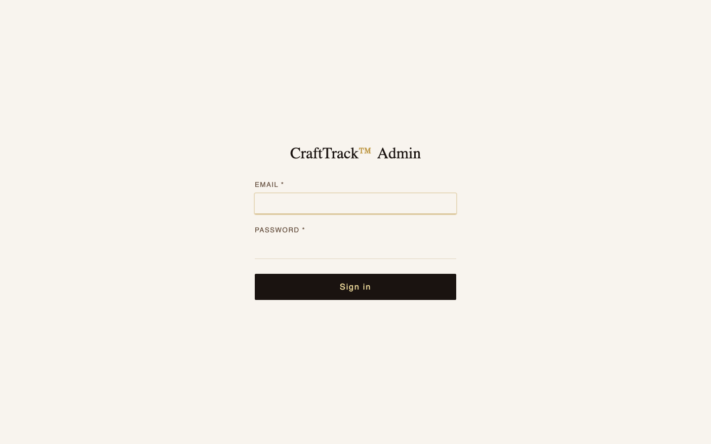

### 2. Admin Dashboard

The Orders list — every order across every customer, searchable by order
number or customer name. Note **`GHD-2026-014` shows "3 journeys"**
where a single-journey order like `HTL-2026-001` shows its one stage
badge directly — the list view itself reflects the 1-to-many
architecture without any special-casing.

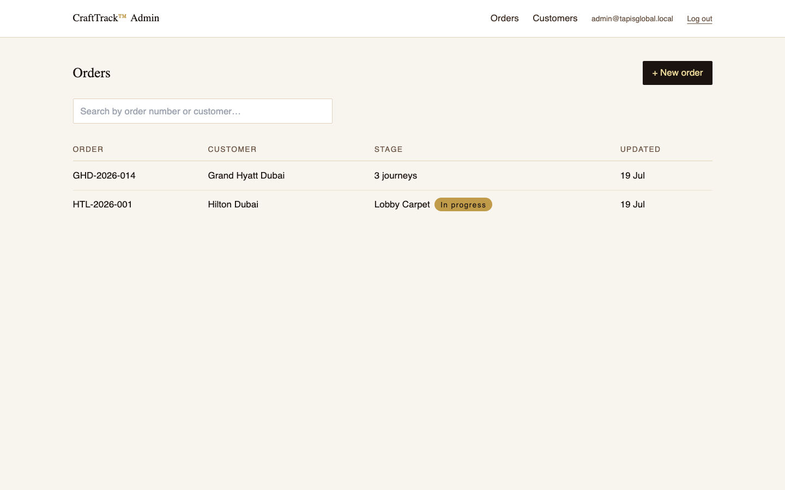

### 3. Journey Workspace

Opening a journey (Hilton Dubai's "Lobby Carpet") lands on the day-to-day
workspace: cover photo, current-stage indicator, a "Preview customer
experience" link (opens the exact customer-facing render in a new tab),
and the six-stage list — each tagged **Live** (published) or **Draft**
(not yet visible to the customer).

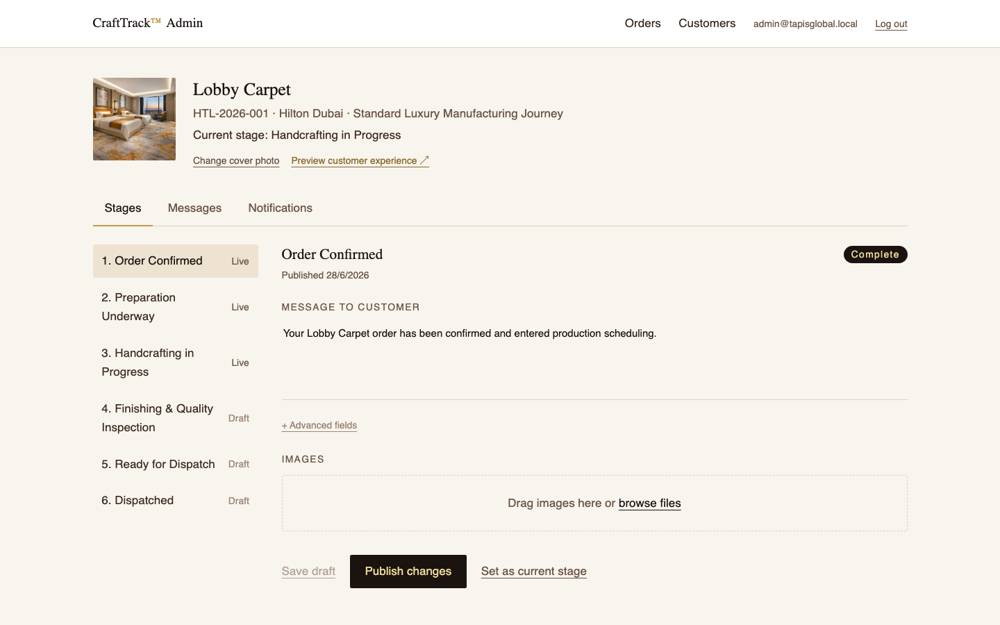

### 4. Stage Editor

Selecting a stage (here, the current stage, "Handcrafting in Progress")
opens its editor: the customer-facing message, an (optional, collapsed
by default) status field, an image upload/gallery panel, and the
Save Draft / Publish Changes actions. Publishing is what actually moves
draft content into what the customer sees — nothing is customer-visible
until this step.

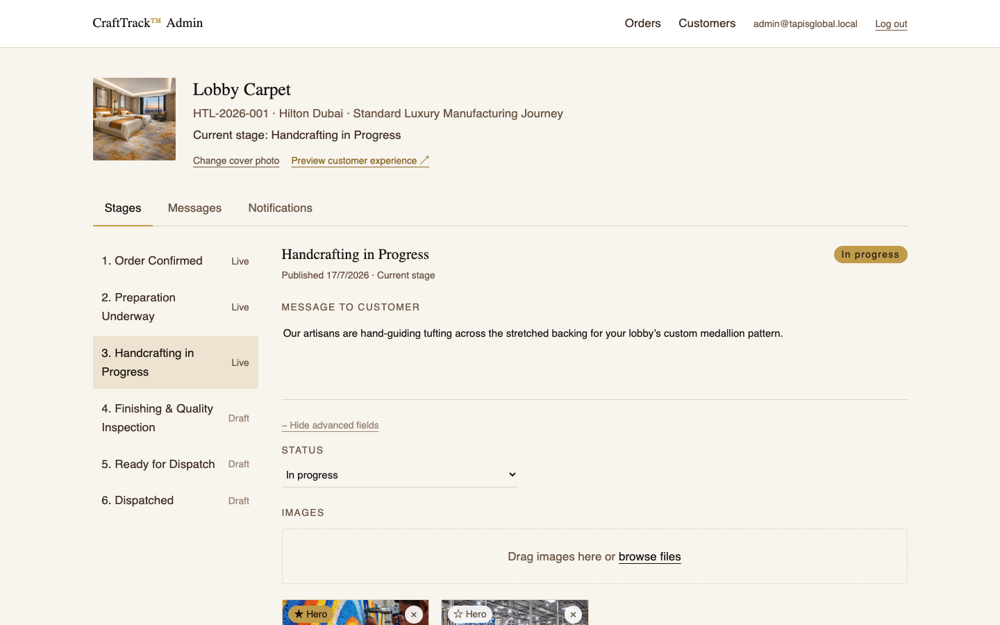

### 5. Notifications

Every customer notification email — first send or retry — is logged
here with its status, recipient, and timestamp, so staff can see (and,
if it ever fails, retry) delivery without digging through server logs.

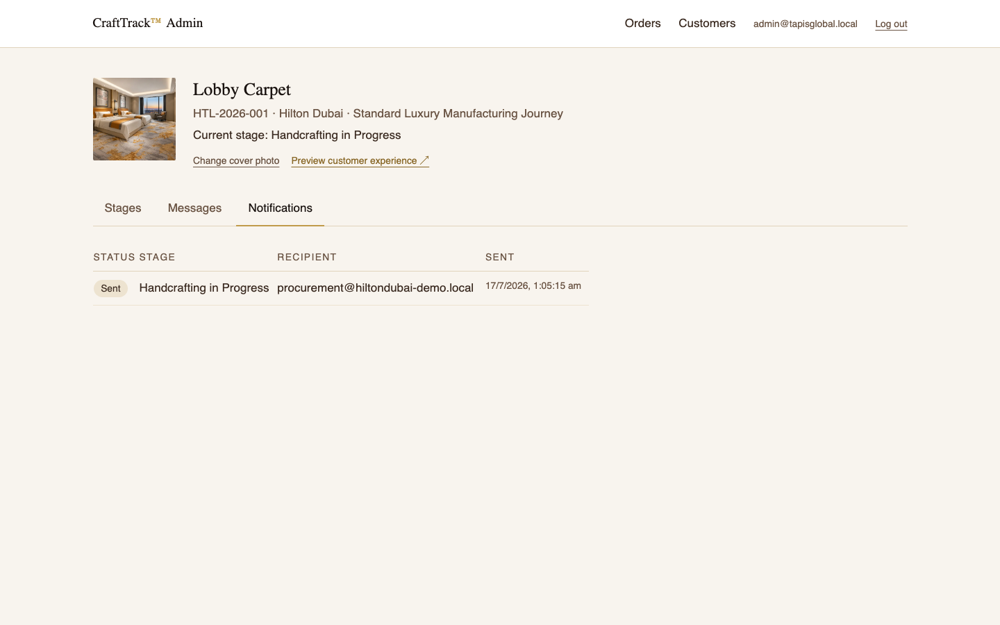

---

## Part 2 — Customer: following the order

### 6. Customer Login

The customer-facing entry point, `/crafttrack/access`, with two modes:
"I have an order number" (order number + email — no account needed) and
"I have an account" (email + password, for a customer who's set one up).

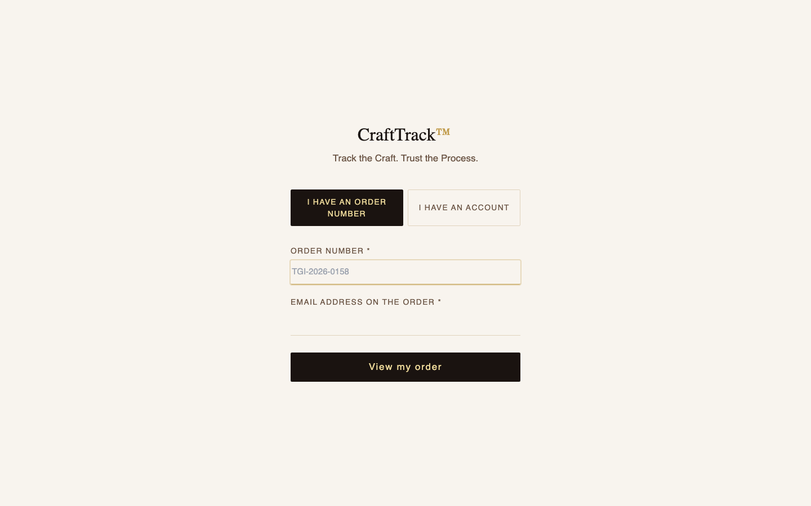

### 7. Journey Cover

After a successful order lookup, the customer lands on a full-bleed
cover screen for their piece — product name, order number, and an
"Enter Journey" call to action. This is the route's LCP image and is
loaded with priority.

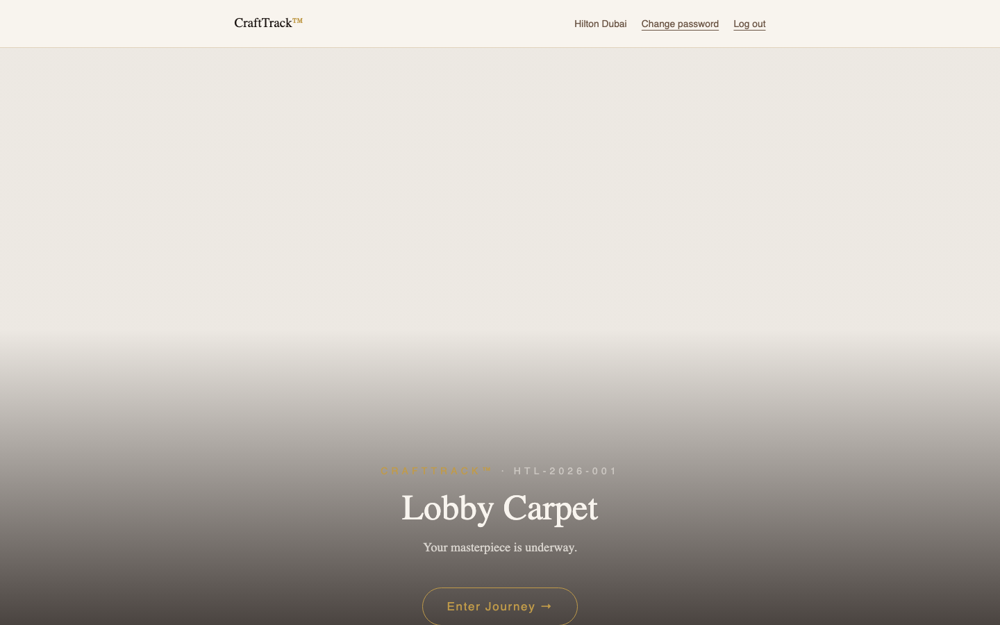

### 8. Customer Timeline

Entering the journey reveals the real production timeline — published
stages in full (message, photos, status, date), upcoming stages shown
muted with only their name, so the customer always knows how many steps
remain without ever seeing draft/internal content.

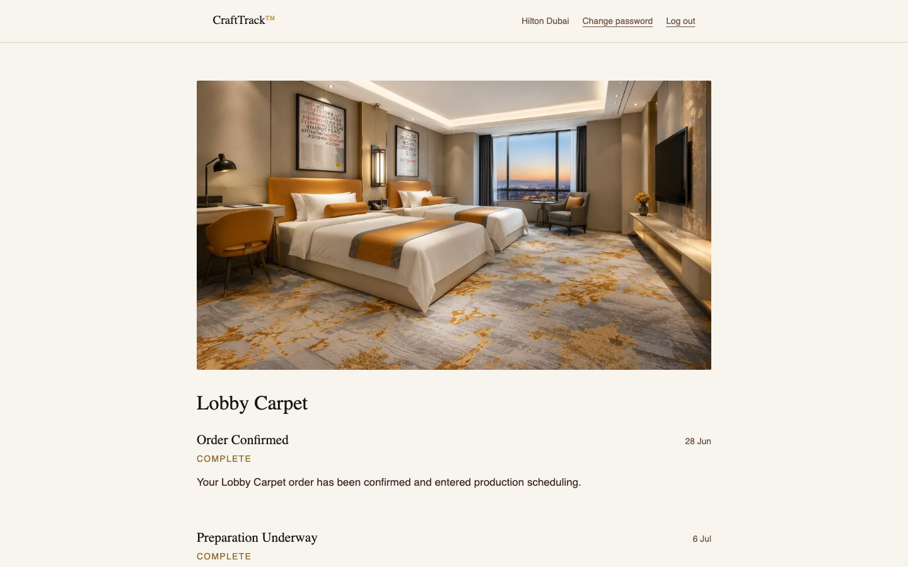

### 9. Gallery Lightbox

Clicking any stage photo opens a fullscreen, focus-trapped lightbox
spanning every photo across the whole journey (not just one stage) —
arrow-key or on-screen prev/next navigation, captions, and Escape to
close.

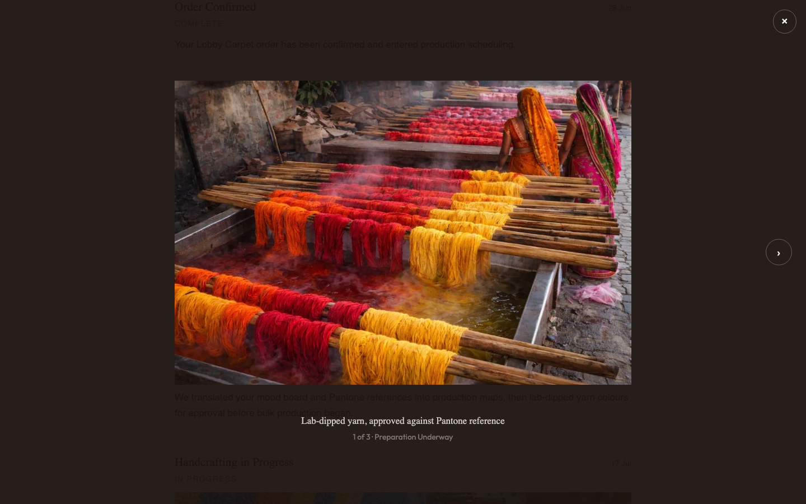

### 10. Completion Screen

When a journey's final stage publishes as complete, the customer's
timeline ends in a celebratory banner instead of just stopping. This
capture uses Grand Hyatt Dubai's **Restaurant Carpet** journey, which is
genuinely, fully published end-to-end — a real completed order, not a
temporarily-forced status.

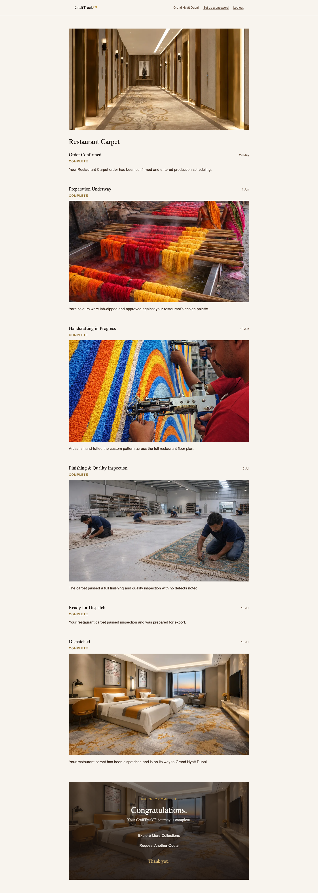

### Bonus — Multi-Journey Picker

Logging in with Grand Hyatt Dubai's order number lands here first,
since that order has three journeys: a lightweight picker (cover photo +
name per journey) is the *only* extra step a multi-piece order ever
adds — a single-journey order (like Hilton Dubai's) skips this screen
entirely and goes straight to its one journey.

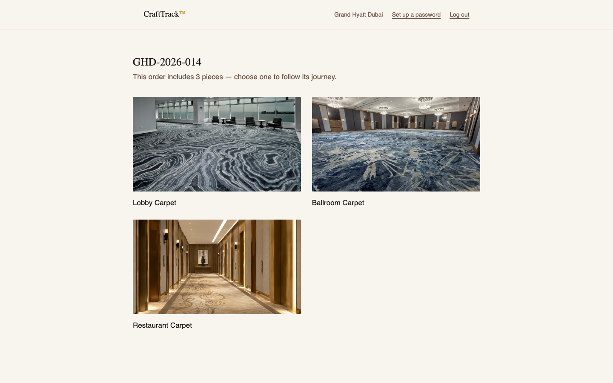

---

## Part 3 — Public & marketing surfaces

### 11. Demo Journey

`/crafttrack/demo` is the one public, indexable route under
`/crafttrack/*` — a fully interactive sample journey ("Premium Hand
Tufted Carpet") that needs no login and no real order, ending in a
Request a Quote / Request Catalogue call to action. This is what a
prospect sees before they've ever ordered anything.

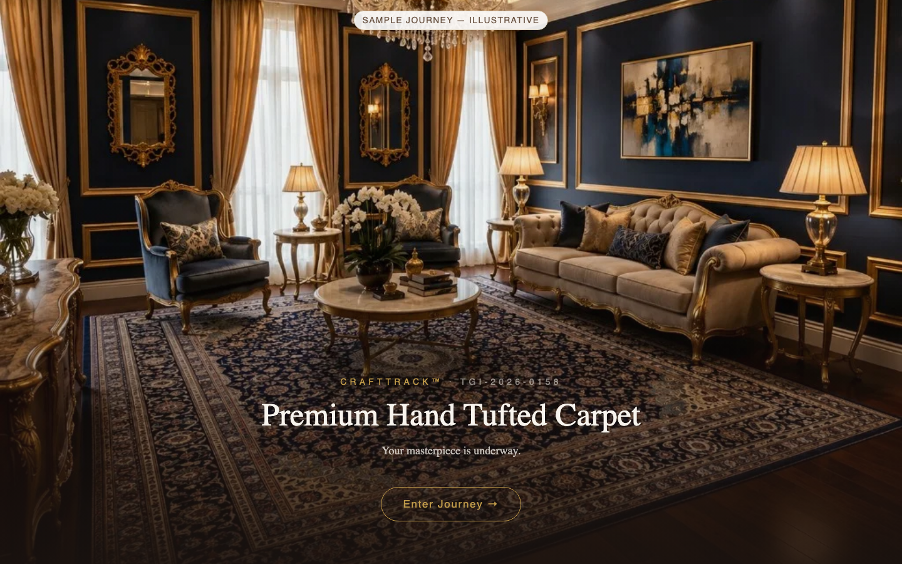

### 12. Floating CraftTrack Button

A site-wide entry point, stacked directly above the WhatsApp button on
every public page, so a visitor is never more than one click from either
tracking a real order or trying the demo.

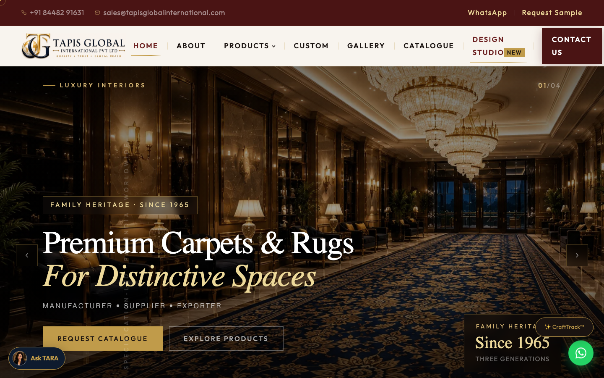

### 13. CraftTrack Modal

Clicking the floating button opens a focus-trapped teaser modal — the
marketing pitch plus two paths: "Experience CraftTrack™" (the public
demo) or "Already Ordered? Access My CraftTrack" (the real portal).

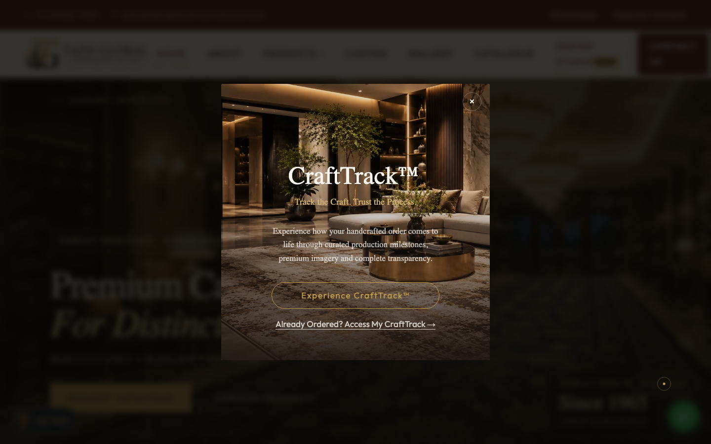

---

## Mobile

Every screen above was also captured at 390×844 to confirm the mobile
layout holds up — full set under
[`crafttrack-screenshots/`](crafttrack-screenshots/) as `*-mobile.png`.
Two representative examples:

| Customer Timeline (mobile) | Admin Dashboard (mobile) |
|---|---|
| 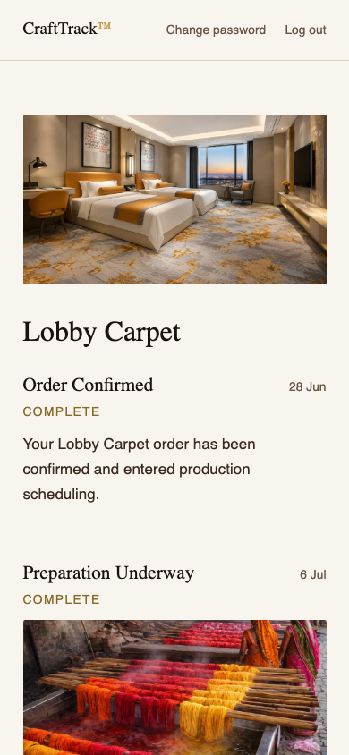 | 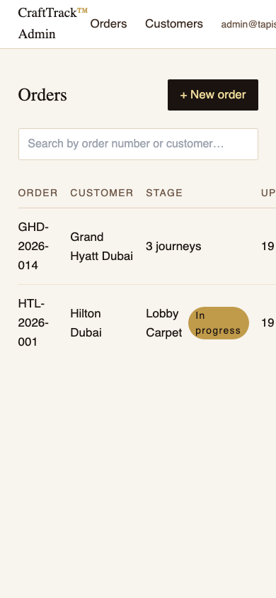 |

---

## Architecture notes this walkthrough demonstrates

- **Order → Journey is one-to-many.** `HTL-2026-001` has one journey;
  `GHD-2026-014` has three, each independently tracked, published, and
  messaged. No schema or code change was needed between the two — the
  multi-journey picker (screen 14) and the "3 journeys" badge (screen 2)
  are just the same single-journey code path rendering a real second
  case.
- **Draft vs. Published is real, not cosmetic.** Stages 4–6 of Hilton
  Dubai's journey exist in the database (so the customer can see "3 of 6
  steps done") but expose nothing except their name until an admin
  actually publishes them — verified directly in this walkthrough by
  comparing the admin Stage Editor (draft content) against the Customer
  Timeline (published-only content) for the same journey.
- **Completion is data-driven, not a special screen.** The completion
  banner (screen 10) isn't a separate page — it's the same
  `PublishedJourneyView` component rendering the ordinary case where a
  journey's final stage has actually published as complete.
